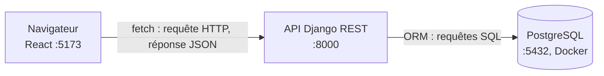

# GRID INSIGHT

Grid Insight est une application web qui permet de suivre la consommation et la production d'électricité en France, par filière, à partir des données ouvertes de RTE (mises à jour toutes les 15 minutes environ).

Gris Insight is a web application that lets you follow the French electricty consumption and production, by energy source, using RTE open datas (updated every 15 minutes approximately)

